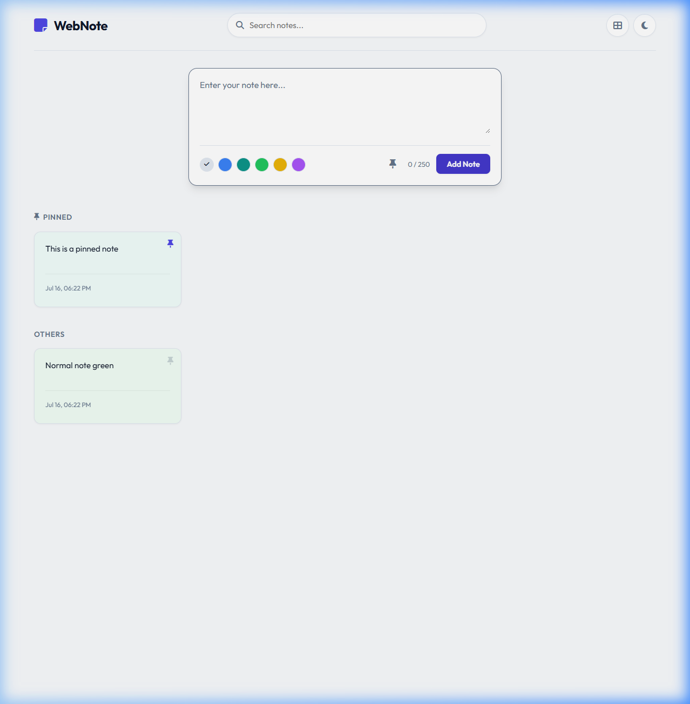
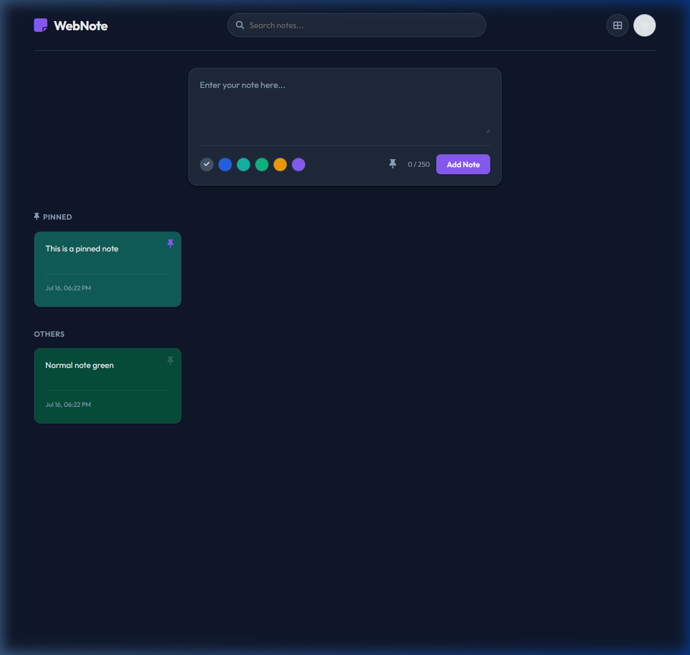

# WebNote — Premium Full-Stack Note Manager

A clean, responsive, full-stack note-taking web application built with **Node.js**, **Express.js**, and **MongoDB**. Designed with a modern glassmorphic UI, rich interactive capabilities, and automated integration test coverage.

---

## User Interface Showcase

Here is a visual overview of WebNote in action across different themes:

| Light Mode Dashboard | Dark Mode Dashboard |
|:---:|:---:|
|  |  |

---

## Features

### Core Capabilities
- **Pinning Notes**: Pin key notes to a dedicated "PINNED" section at the top of the dashboard.
- **Color Coding**: Select from a curated pastel palette (default, blue, teal, green, yellow, purple) that maps beautifully to both light and dark themes.
- **Interactive Checklists**: Insert checkboxes (using `- [ ]` markdown syntax) that render as clickable HTML checkboxes. Clicking them toggles states and dynamically syncs with the database.
- **Real-Time Client Search**: Instant search filtering as you type in the search bar.
- **Grid / List Views**: Switch layouts smoothly between card grid and list styles (saves automatically to `localStorage`).
- **Copy-to-Clipboard**: Copy note contents with one click, showing a temporary checkmark indicator for UX feedback.
- **Character Counter**: Real-time counter limiting note contents to 250 characters.

### Developer Experience (DX) & Architecture
- **In-Memory MongoDB Database Fallback**: If no `MONGODB_URI` environment variable is defined, the application automatically spins up a local in-memory database (`mongodb-memory-server`) to enable instant setup without dependencies.
- **Clean Code Principles**: Adheres strictly to SOLID/Clean Code guidelines: modular functions, single responsibility routes, clear variable naming, separation of concerns, and robust centralized error handling.
- **API Test Suite**: Includes integration tests verifying CRUD endpoints and validation rules in an isolated environment.

---

## Technology Stack

- **Backend**: Node.js, Express.js (REST APIs, CORS, middleware, global error handlers)
- **Database**: MongoDB with Mongoose (Timestamps, validation, formatting transforms)
- **Frontend**: HTML5, Vanilla CSS (Variables, Grid/Flexbox, transitions), Vanilla ES6 JavaScript
- **Testing**: Jest, Supertest, MongoDB Memory Server

---

## REST API Endpoints

All notes endpoint routes are mounted under `/api/notes`:

| Method | Endpoint | Request Body | Description |
|:---|:---|:---|:---|
| **GET** | `/api/notes` | *None* | Retrieve all notes (sorted newest first) |
| **POST** | `/api/notes` | `{ "text": "...", "isPinned": false, "color": "..." }` | Create a new note |
| **PUT** | `/api/notes/:id` | `{ "text": "...", "isPinned": true, "color": "..." }` | Update text, pinning, or color by ID |
| **DELETE** | `/api/notes/:id` | *None* | Permanently delete a note by ID |

---

## Getting Started

### Prerequisites
- **Node.js** (v16 or higher recommended)

### Installation
1. Clone the repository and navigate to the project directory:
   ```bash
   cd WebNote
   ```
2. Install npm packages:
   ```bash
   npm install
   ```

### Running Locally
- **Start production server**:
  ```bash
  npm start
  ```
- **Start development mode (with nodemon auto-restart)**:
  ```bash
  npm run dev
  ```

*Once the server is running, open [http://localhost:5000](http://localhost:5000) in your web browser.*

### Running Tests
Automated integration tests run against an isolated in-memory Mongo instance:
```bash
npm run test
```